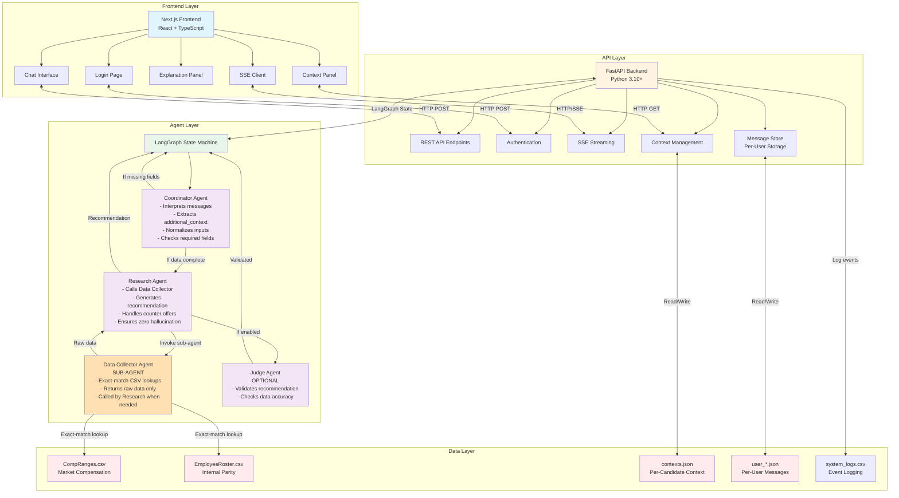
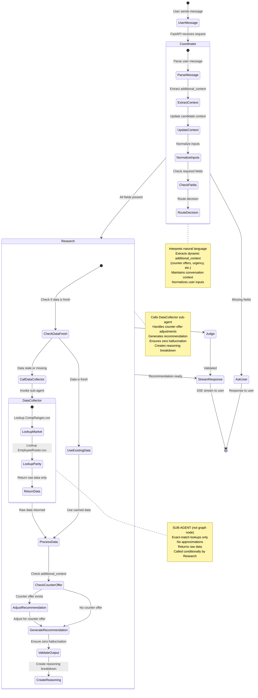
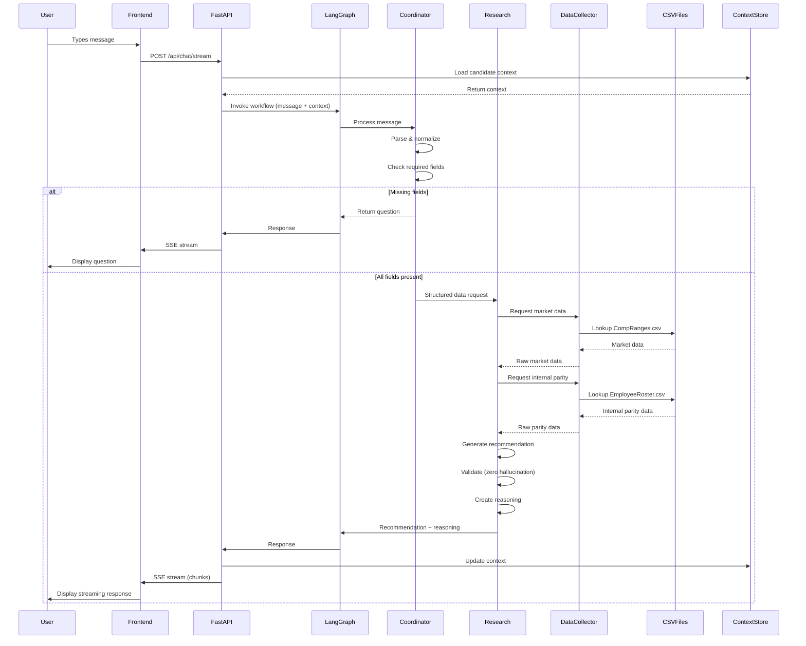
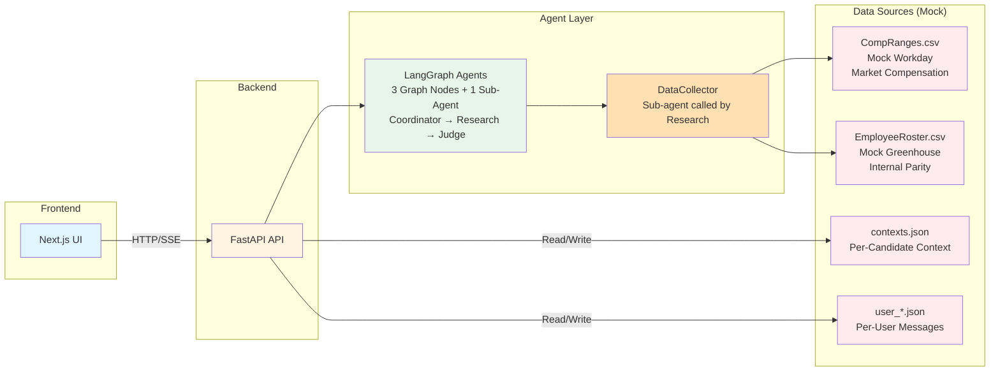
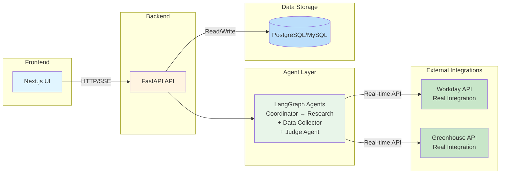

# B. High-Level Architecture

## Architecture Overview

The Compensation Recommendation Conversational Assistant is a POC (Proof of Concept) built with a three-tier architecture: frontend (Next.js), backend (FastAPI), and agent layer (LangGraph). The system uses a **three-agent architecture** with the following components:

1. **Coordinator Agent**: Entry point that handles user messages, extracts context, and routes to research
2. **Research Agent**: Generates compensation recommendations using data from the Data Collector
3. **Data Collector Agent**: Sub-agent called by Research to fetch market and parity data from CSV files
4. **Judge Agent** (Optional): Validates recommendations against data (can be enabled via settings)

The system also features a **dynamic additional_context system** that captures any relevant information from user messages (counter offers, salary expectations, urgency, etc.) and accumulates it across the conversation.

## System Architecture

## Agent Workflow

## Data Flow

## Agent Responsibilities

### Coordinator Agent
- Interprets natural language user messages
- **Extracts dynamic additional_context** from messages (counter offers, salary expectations, urgency, special notes, etc.)
- **Accumulates additional_context** across conversation turns (merges new with existing)
- Maintains conversation context per candidate
- Normalizes user inputs (job title, location mapping, interview feedback)
- Validates required fields are collected (candidate_id, job_title, job_level, location, job_family, interview_feedback)
- Validates job level is valid (P1-P5)
- Routes workflow based on conversation state
- Handles greetings and off-topic messages appropriately

### Research Agent
- Receives structured data from Coordinator Agent
- **Conditionally invokes Data Collector Agent** (only if data is stale or missing)
- Reuses cached data if job_title/location match previous request
- **Processes additional_context** from Coordinator:
  - Adjusts recommendations for counter offers
  - Considers current salary for meaningful increases
  - Notes urgency in response
  - Applies special circumstances
- Generates compensation recommendation based on collected data
- **Handles counter offer scenarios**:
  - If counter offer is within market range: adjusts base salary to meet it
  - If counter offer exceeds market max: offers max + enhanced equity, flags for review
- Calculates accurate percentile, bonus, and total compensation
- Ensures zero hallucination (all values traceable to CSV data)
- Creates detailed reasoning breakdown with citations
- Flags guardrail violations

### Data Collector Agent (Sub-Agent)
- **Sub-agent invoked by Research Agent** (not a separate graph node)
- **Called conditionally**: only when Research Agent determines fresh data is needed
- Performs exact-match lookups in CompRanges.csv for market compensation
- Performs exact-match lookups in EmployeeRoster.csv for internal parity
- Returns raw data values only (no calculations or estimates)
- Never generates or approximates values
- Caches results for reuse within same job_title/location combination

### Judge Agent (Optional)
- **Enabled via settings** (`enable_judge_agent`)
- Validates recommendation against data
- Checks that base salary is within market min/max
- Verifies reasoning cites actual data sources
- Detects hallucinated numbers
- Flags recommendations that need review

## Data Sources

### CompRanges.csv (Market Compensation Data)
- Columns: Job Title, Location, Currency, Min, Max, Compensation Range
- Lookup: Exact match on Job Title + Location
- Returns: Min, Max, and Compensation Range as-is
- No approximations or fallbacks

### EmployeeRoster.csv (Internal Parity Data)
- Columns: Name, Job Title, Proficiency, Location, Compensation
- Lookup: Exact match on Job Title + Location
- Operations: Direct min/max, count
- Not allowed: Percentile estimation, trend analysis, predictive modeling

### Context Store (contexts.json)
- Location: `/data/contexts.json`
- Structure: Candidate ID → structured context object
- **Per-candidate storage**: Each candidate has their own context
- Contains: Required fields, additional_context, recommendation_history
- Retention: 60 days with auto-expiry

### Message Store (Per-User JSON files)
- Location: `/data/messages/user_<email>.json`
- **Per-user storage**: Messages organized by user, not candidate
- Structure: Array of message objects with candidate_id references
- Contains: User messages, assistant responses, timestamps, candidate associations
- Enables: Loading all user's messages, filtering by candidate

### Additional Context (Dynamic)
- Stored within candidate context as `additional_context` field
- **Dynamically extracted** by Coordinator from user messages
- **Accumulated** across conversation (new values merged with existing)
- Examples of captured information:
  - `counter_offer`: Competing offer amount
  - `current_salary`: Candidate's current compensation
  - `urgency`: Time-sensitive notes
  - `special_notes`: Any other relevant details
  - `relocation_needed`: Relocation requirements
  - `signing_bonus_request`: Requested signing bonus

### System Logs (CSV file)
- Location: `/data/logs/system_logs.csv`
- Tracks: All events (messages, responses, agent activity, recommendations, errors)

## Integration Map

### Current State (POC)

**Architecture Summary**:
- **3 Graph Nodes**: Coordinator, Research, Judge (optional)
- **1 Sub-Agent**: DataCollector (called by Research, not a graph node)
- **Per-User Messages**: Messages stored by user email, not candidate
- **Per-Candidate Context**: Context stored by candidate ID
- **Dynamic Context**: additional_context extracted and accumulated from messages

### Future Enhancements (V2)

**Planned Enhancements**:
- **Judge Agent**: Additional validation layer for recommendations (future enhancement)
- **Workday API**: Real-time market compensation data integration
- **Greenhouse API**: Employee roster and candidate information integration
- **Database**: Replace JSON/CSV storage with relational database

## Technology Stack

### Frontend
- **Next.js 14+**: React-based web framework
- **TypeScript**: Type safety
- **Tailwind CSS**: Styling
- **Zustand**: Client-side state management
- **Server-Sent Events (SSE)**: Real-time response streaming

### Backend
- **FastAPI**: Python web framework
- **LangGraph**: Agent orchestration and state management
- **Pydantic**: Data validation
- **Pandas**: CSV data processing

### Data Storage
- **JSON files**: Context persistence
- **CSV files**: Market data, internal parity, system logs

### Environment
- **Python 3.10+**: Runtime environment
- **Virtual environment**: `/backend/.venv`
- **Environment variables**: `/backend/.env` (API keys, configuration)
